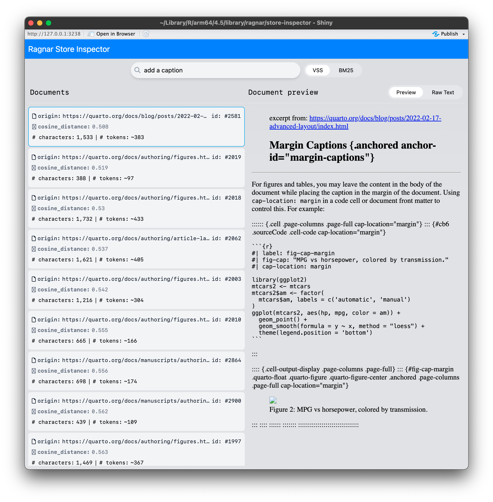

```{r, include = FALSE}
knitr::opts_chunk$set(
  collapse = TRUE,
  comment = "#>"
)
```

``` r
library(ragnar)
```

# Getting Started with ragnar

Retrieval-Augmented Generation (RAG) is a practical technique for
improving large language model (LLM) outputs by grounding them with
external, trusted content. The `ragnar` package provides tools for
building RAG workflows in R, with a focus on transparency and control at
each step.

This guide walks through building a simple chat tool for Quarto
documentation using `ragnar`. The code examples are simplified for
clarity; for a full implementation, see
<https://github.com/t-kalinowski/quartohelp>.

## Why RAG? The Hallucination Problem

LLMs can produce remarkable outputs: fluent, confident, plausible
responses to a wide range of prompts. But anyone who has spent time with
ChatGPT or similar models has observed responses that are confident,
plausible, and wrong.

When the generated output is wrong, we call that a *hallucination*, and
hallucinations seem to be an inherent consequence of how LLMs work. LLMs
operate on text sequences; they do not seem to possess a concept of
"facts" and "truth" like humans do. They generate text with no awareness
of whether it is true or false, only guided by similarity to patterns in
text sequences in their training data.

Put simply, in philosopher Harry Frankfurt's sense of the word, the
models generate "bullshit" [^1]:

[^1]: <https://press.princeton.edu/books/hardcover/9780691122946/on-bullshit>

> It is impossible for someone to lie unless he thinks he knows the
> truth. Producing bullshit requires no such conviction. A person who
> lies is thereby responding to the truth, and he is to that extent
> respectful of it. When an honest man speaks, he says only what he
> believes to be true; and for the liar, it is correspondingly
> indispensable that he considers his statements to be false. For the
> bullshitter, however, all these bets are off: he is neither on the
> side of the true nor on the side of the false. His eye is not on the
> facts at all, as the eyes of the honest man and of the liar are,
> except insofar as they may be pertinent to his interest in getting
> away with what he says. He does not care whether the things he says
> describe reality correctly. He just picks them out, or makes them up,
> to suit his purpose.

RAG addresses this by retrieving relevant excerpts from a corpus of
trusted, vetted sources and asking the LLM to summarize, paraphrase, or
answer the user's question using only that material. This grounds the
response in known content and reduces the risk of hallucination. RAG
shifts the LLM's job from open-ended generation to summarizing or
quoting from retrieved material.

RAG reduces but does not eliminate hallucinations. For richer texts and
tasks, LLMs may still miss nuance or overgeneralize. For this reason,
it's helpful if RAG-based tools present links back to the original
material so users can check context and verify details.

## Use Case: Quarto Docs Chat vs. Standard Search

Standard documentation search is the default for answering questions
about tools like Quarto but has limitations. Search requires precise
wording, familiarity with the docs' structure, and sometimes piecing
together information from multiple pages. Even with a focused site
search, users spend time skimming and navigating to the correct
material, and may still miss the answer.

A RAG-powered chat tool could offer a better alternative. You ask a
natural language question. The tool retrieves relevant excerpts from the
docs using both semantic and keyword-based search, then asks the LLM to
answer using only those excerpts. The result is a concise, context-aware
answer, complete with links to the relevant docs. Of course, that only
is useful if the LLM actually provides correct and useful answers.

## Setting up RAG

At a high level, setting up RAG has two stages: preparing the knowledge
store (a database of processed content), and establishing the workflow
for retrieval and chat.

### Creating the Store

First, create a store. The store holds your processed docs and
embeddings. When you create the store, you select the embedding
provider. This choice is fixed for the store, but you can always create
a new store if you want to change it.

``` r
store_location <- "quarto.ragnar.duckdb"
store <- ragnar_store_create(
  store_location,
  embed = \(x) ragnar::embed_openai(x, model = "text-embedding-3-small")
)
```

To generate embeddings, you can use an open-source model via
`embed_ollama()`, models from commercial providers via `embed_openai()`,
`embed_google_vertex()`, `embed_bedrock()`, and `embed_databricks()`, or
your own function.

#### Identify Documents for Processing

Gather a list of documents you want to insert in the database. For local
files, this can be a simple `list.files()` on a directory of documents.

If you're building a store from a website, you can use
`ragnar_find_links()` to collect URLs.

``` r
paths <- ragnar_find_links("https://quarto.org/", depth = 3)
```

For some sites, it may be easier to clone and build the site locally,
then reference the files from the local file system. You can also
process a [sitemap](https://quarto.org/sitemap.xml) if one is available.

At the end of this step, you should have a character vector of file
paths and URLs.

#### Convert Documents to Markdown

Convert each document to markdown. Markdown is preferred because it's
plain text, easy to inspect, keeps token counts low, and works well for
both humans and LLMs.

For this step, ragnar provides `read_as_markdown()`, which can accept a
wide variety of formats (pdf, docx, pptx, html, zip files, epubs, etc.).
In many cases it works well, but for specialized needs you can opt for a
more custom-tailored approach. See the help in `?read_as_markdown` for
some guidance on alternatives if you'd like to improve on the default
conversion. (But only begin optimizing once you have a basic app
working.)

`read_as_markdown()` returns a `MarkdownDocument` object, which is a
normalized string of markdown text with `@origin` property.

If you opt to use something besides `read_as_markdown()` to read in
content--such as `readLines()`, `pdftools::pdf_text()`, or a
sophisticated OCR tool--you can turn a character vector into a
`ragnar::MarkdownDocument` object with the `MarkdownDocument()`
constructor.

#### Chunk and Augment

Next, split the documents into smaller chunks. This is necessary because
embedding models have context size limits, and because chunking allows
you to return just the most relevant excerpts from a long document.

Chunking is delicate; Ideally, each chunk should stand alone without
relying on the context of the surrounding document. We can aim to split
the text at natural points like headings or paragraphs, and avoid splits
in the middle of a sentence or word.

Additionally, we can augment chunks with context that describes the
chunk’s origin--such as URL, title, headings, and subheadings--both so
the LLM can provide links back to the source, and so the LLM and
embedding models can better situate the chunk’s content.

To help with these tasks, use `markdown_chunk()`.

`markdown_chunk()` splits the document into chunks and nudges each
chunk’s edges to the nearest semantic break. By default, a chunk is
about 1,600 characters--roughly one page--with a 50% overlap between
chunks.

`markdown_chunk` also extracts any markdown headings in scope for each
chunk start. These headings are added as context during embedding and
retrieval, helping the LLM produce better answers.

You can specify chunking boundaries with `markdown_chunk()`'s
`segment_by_heading_levels` argument, which takes a vector of integers
between 1 and 6. Chunks will not overlap a defined segment boundary.

Note that an alternative approach for augmenting chunks with context can
be to use an LLM with instructions to "situate this excerpt from this
document," or, worse, "summarize this document." This can work but
carries significant risk. Remember, the goal is to create a knowledge
store--a trusted, factual, vetted source of truth. Giving an LLM an
opportunity to corrupt this store with hallucinations may be necessary
depending on your needs, but as an initial approximation, I recommend
starting with an ingestion pipeline that does not give any opportunities
for hallucinations to enter the store.

#### Insert in the Store

Take your augmented document chunks and insert them into the store by
calling `ragnar_store_insert()`. This function will automatically
generate embeddings using the `embed` function specified when the store
was first created.

``` r
ragnar_store_insert(store, chunks)
```

#### Tying it Together

Repeat these steps for every document you want to insert into the store.
Once you're done processing the documents, call
`ragnar_store_build_index()` to finalize the store and build the index.

``` r
for (path in paths) {
  chunks <- path |>
    read_as_markdown() |>
    markdown_chunk()
  ragnar_store_insert(store, chunks)
}

ragnar_store_build_index(store)
```

Once the store index is built, the store is ready for retrieval.

------------------------------------------------------------------------

## Retrieval

To retrieve content from the store, call `ragnar_retrieve()`. This
function uses two retrieval methods:

-   **Vector similarity search (vss):** Retrieves chunks whose
    embeddings are most similar to the query embedding. This is semantic
    search, used to find content conceptually related to the query, even
    if different words are used.
-   **BM25:** Retrieves chunks based on keyword matching, using
    techniques like stemming and term frequency. This is a conventional
    text search, used to find content containing specific words or
    phrases.

To limit the search to one method, use `ragnar_retrieve_vss()` or
`ragnar_retrieve_bm25()`.

You can register `ragnar_retrieve()` as an LLM tool. This is an
effective technique for implementing RAG, as it allows the LLM to
rephrase unclear questions, ask follow-up questions, or search more than
once if needed. Register `ragnar_retrieve()` as a tool with
`ellmer::Chat` using `ragnar_register_tool_retrieve()`:

``` r
client <- ellmer::chat_openai()
ragnar_register_tool_retrieve(
  client, store, top_k = 10,
  description = "the quarto website"
)
```

Note that the registered tool is intentionally simple. It asks the LLM
to provide one argument: the query string. LLM tool calls are just text
completions after all, like any other LLM output. We minimize the
complexity in the tool interface to minimize opportunities for LLM to
make errors.

Rather than exposing detailed search options to the LLM, we can instead
set a high `top_k` value to return more chunks than usually necessary.
This provides some slack in the chat app, so we can gracefully handle
less-than-perfectly-ranked search results.

### Customizing Retrieval

For more context-specific tasks, you may want to define your own
retrieval tool and pair it with a system prompt that explains how to use
the results.

For example, suppose you want the LLM to perform repeated searches if
the first search does not return relevant information, and you also want
to ensure repeated searches do not return previously seen chunks. Here's
an example of how you might do this

First, set up the system prompt:

``` r
client <- chat_openai(model = "gpt-4.1")
client$set_system_prompt(glue::trim(
  "
  You are an expert in Quarto documentation. You are concise.
  Always perform a search of the Quarto knowledge store for each user request.
  If the initial search does not return relevant documents, you may perform
  up to three additional searches. Each search will return unique, new excerpts.
  If no relevant results are found, inform the user and do not attempt to answer the question.
  If the user request is ambiguous, perform at least one search first, then ask a clarifying question.

  Every response must cite links to official documentation sources.
  Always include a minimal, fully self-contained Quarto document in your answer.
  "
))
```

Next, define a custom tool:

``` r
rag_retrieve_quarto_excerpts <- local({
  retrieved_chunk_ids <- integer()
  function(text) {
    # Search, excluding previously seen chunks
    chunks <- ragnar::ragnar_retrieve(
      text,
      top_k = 10,
      filter = !.data$chunk_id %in% retrieved_chunk_ids
    )

    # Update seen chunks
    retrieved_chunk_ids <<- unique(unlist(c(retrieved_chunk_ids, chunks$chunk_id)))

    # Return the chunks dataframe directly;
    # ellmer will format this to json as a row-oriented list of objects.
    chunks
  }
})
```

This approach presents retrieved content directly in json. Presenting
content in a defined structure helps prevent the LLM from confusing
retrieved content with user queries, and confusing chunk metadata (like
headings or origin) with the chunk text. The row-oriented format also
ensures that all metadata (such as headings) stays attached to each row,
so the context for each chunk appears next to its content.

Register the custom tool:

``` r
client$register_tool(ellmer::tool(
  rag_retrieve_quarto_excerpts,
  glue::trim(
    "
    Use this tool to retrieve the most relevant excerpts from the Quarto
    knowledge store for a given text input. This function:
    - uses both vector (semantic) similarity and BM25 text search,
    - never returns the same excerpt twice in the same session
    "
  ),
  text = ellmer::type_string()
))
```

## Troubleshooting and Debugging

Developing a RAG app is an iterative process. There are many places to
potentially spend effort on improvements:

-   selecting sources
-   converting to markdown
-   chunking
-   augmenting chunks
-   using metadata to narrow search
-   choice of embedding model
-   choice of LLM
-   system prompt
-   tool definition

It's helpful to iterate in the context of an end-to-end application.

You can use `ragnar_store_inspect()` to interactively see what kinds of
results are returned by the store for different queries. This helps
confirm that chunking and augmentation preserve semantic meaning and
that the embedding model is working as expected.

If the results shown in the inspector do not seem useful or relevant to
you, they likely won't be useful to an LLM either. Iterate on the store
creation pipeline until retrieval returns meaningful excerpts.



Some things you can try:

-   Increase the chunk size.
-   Specify coarser or custom boundaries in `markdown_chunk()`.
-   Augment chunks with additional context.
-   Try a different embedding model.
-   Try a different LLM.
-   Increase `top_k` to return more results.
-   Iterate on the LLM system prompt to give clearer, more precise
    instructions.

To access the store data directly, use `tbl(store@con, "chunks")`. With
store version 2, you can also access `tbl(store@con, "documents")`. You
can use dbplyr verbs to operate on the remote tbl, and convert it to an
in-memory tibble with `dplyr::collect()`.

Chat interfaces and LLM marketing invite us to think of LLMs as
general-purpose agents, able to answer anything. In practice, however,
as of 2025, building a reliable, accurate, LLM-powered solution where
details and facts matter means carefully scoping what the model is
responsible for.

With that in mind, note that this chat app described here does not
intend to replace documentation or act as a general-purpose assistant.
Its goal is to provide a faster, more contextual way to find the right
place in the docs, with enough information for the user to decide if
they need to read further. It's designed it to allow users to naturally
escalate: if the LLM is not able to provide a useful answer, the user
can use the provided links and transition to reading the source material
without friction.

## Cost Management

Using LLMs and embeddings incurs costs, regardless of whether you use a
commercial provider or an open source model on your own hardware. Some
tips for managing costs:

-   Use a model with a large context window so you can include more
    context, but not necessarily the most expensive reasoning model.
    With RAG, summarization and paraphrasing do not typically need the
    flagship reasoning models to return useful results.
-   The cost of generating embeddings is negligible. For example,
    generating embeddings for the entire Quarto website costs
    approximately a cent.
-   Keep chat sessions focused and concise. Start new chat sessions for
    unrelated questions. Long conversations increase token usage, costs,
    and in practice, also lower output quality as the LLM gets confused
    by stale or irrelevant conversation turns.
-   For reference, with the flagship OpenAI model 'gpt-4.1', each query
    to a RAG-powered chat app like `quartohelp` costs approximately 1
    cent.

## Summary

`ragnar` provides a practical, transparent way to build RAG workflows in
R. By combining semantic and keyword search, clear chunking and
augmentation, and focused prompt and tool design, you can create fast,
interactive documentation chat tools that help users find answers
quickly and reliably.

Building a good RAG system is iterative. Inspect intermediate outputs,
tune chunking and retrieval, and keep the user’s workflow in mind. With
these guardrails, you can reduce hallucinations and deliver trustworthy,
grounded answers--while also giving users a path to the original source.

For more details and a full example, see the
[quartohelp](https://github.com/t-kalinowski/quartohelp) package.
